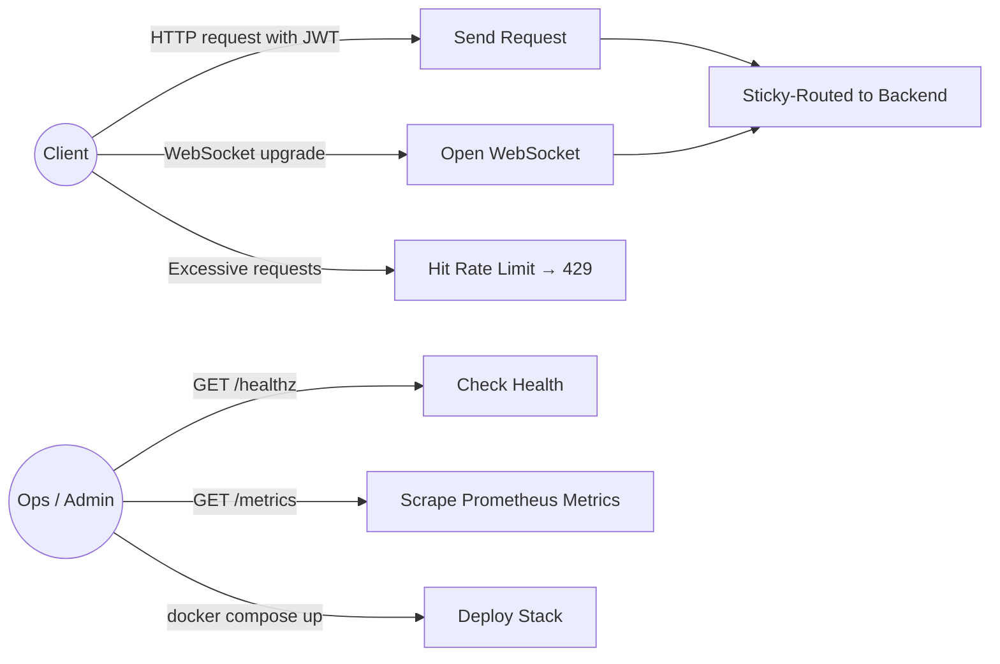
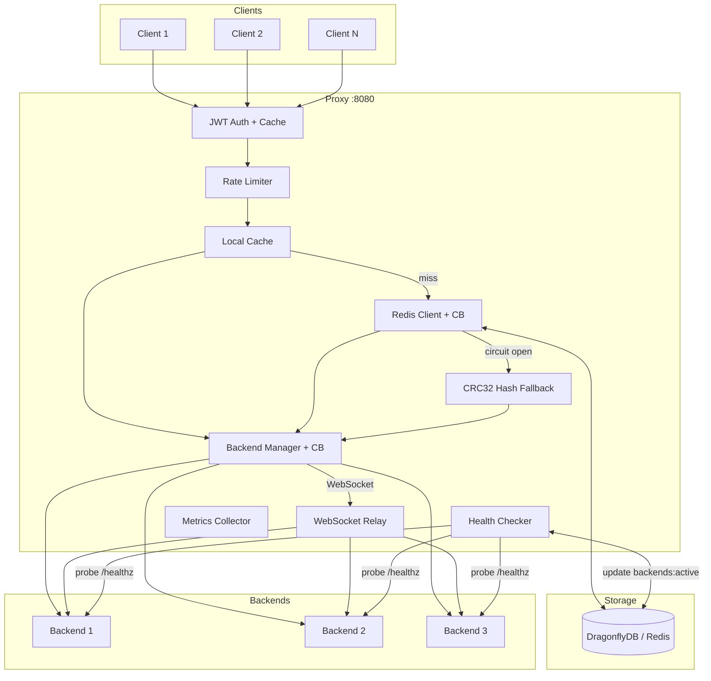
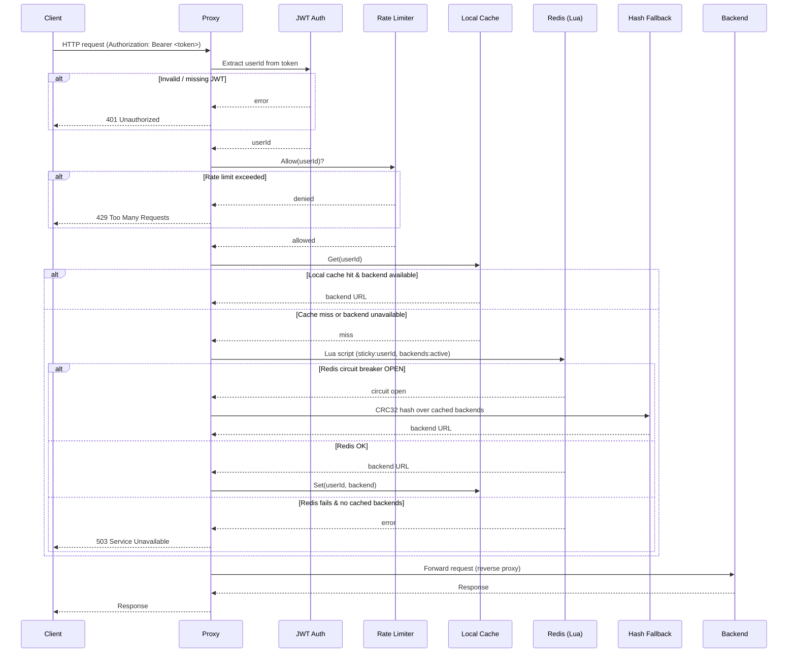
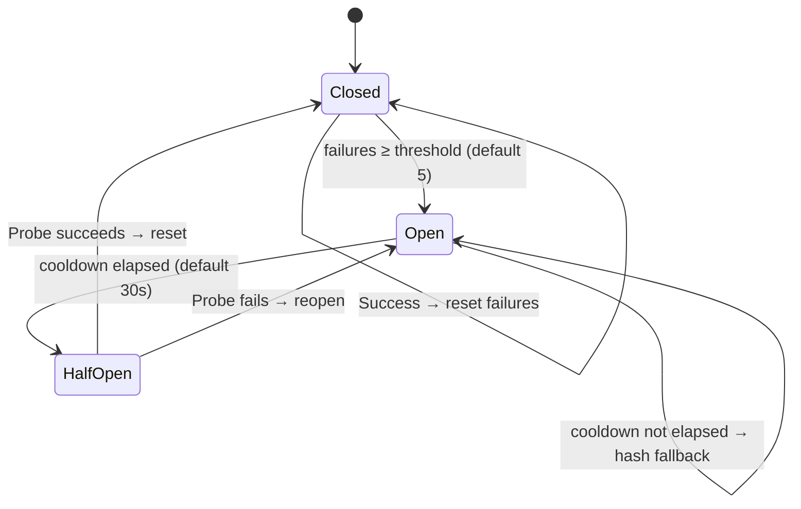
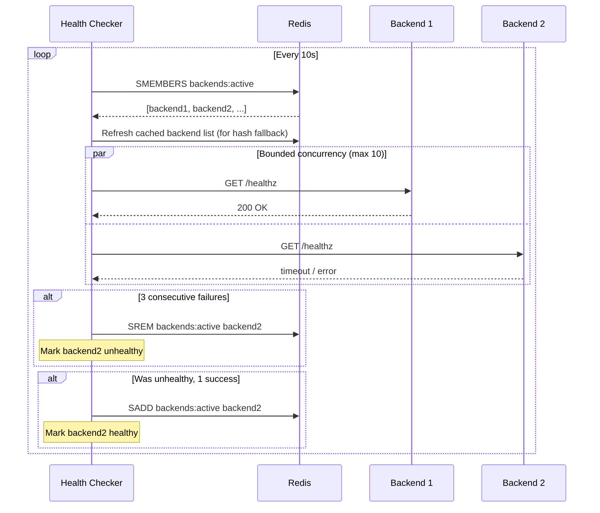
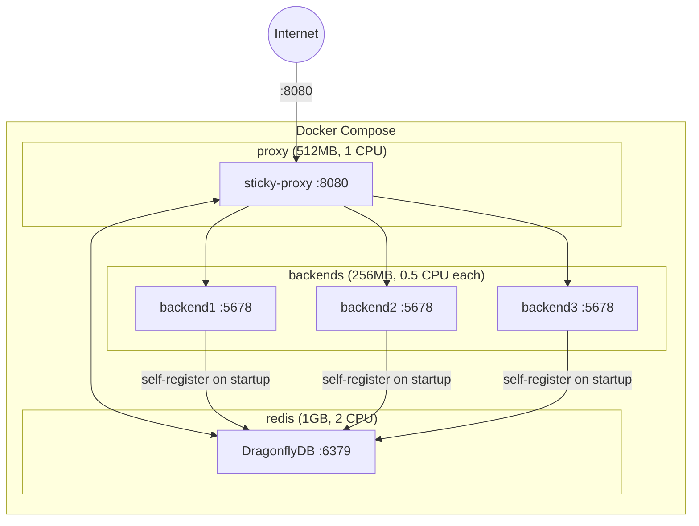

# sticky-proxy

A high-performance sticky-session HTTP/WebSocket reverse proxy written in Go. Routes requests from the same user to the same backend server using JWT-based identification and a two-tier caching strategy (local + Redis).

## Features

- **Sticky sessions** — users are consistently routed to the same backend via Redis-backed mappings with local cache for fast repeated access
- **JWT authentication** — extracts `userId` from Bearer tokens with HMAC signature validation and token caching
- **WebSocket support** — full bidirectional proxying with sticky session persistence
- **Circuit breakers** — for both Redis and individual backends, with automatic CRC32 hash fallback when Redis is unavailable
- **Active health checking** — periodic backend probes with configurable intervals
- **Per-user rate limiting** — token bucket algorithm (100 tokens/sec, 200 burst) with automatic cleanup
- **Prometheus metrics** — request counters, latency histograms, cache hit rates, and more on `/metrics`
- **Graceful shutdown** — drains in-flight requests on SIGTERM/SIGINT (30s timeout)

## Use Cases



## Architecture

### Component Overview



### HTTP Request Flow



### WebSocket Flow


### Redis Circuit Breaker States



### Backend Circuit Breaker States


### Health Checker Behavior



### Deployment Topology



## Quick Start

### Docker Compose

The included `docker-compose.yml` starts DragonflyDB (Redis-compatible), 3 test backends, and the proxy:

```bash
docker compose up -d
```

The proxy is available at `http://localhost:8080`.

### Build from Source

**Requirements:** Go 1.25+

```bash
make build          # outputs bin/proxy and bin/backend
```

Run with a Redis instance available:

```bash
export JWT_SECRET="your-secret-key"
export REDIS_ADDR="localhost:6379"
./bin/proxy
```

## Configuration

All settings are configured via environment variables. Only `JWT_SECRET` is required.

| Variable | Default | Description |
|---|---|---|
| `JWT_SECRET` | *required* | HMAC secret for JWT validation |
| `PROXY_PORT` | `:8080` | Proxy listen address |
| `REDIS_ADDR` | `localhost:6379` | Redis/DragonflyDB address |
| `CACHE_TTL` | `24h` | User-to-backend mapping TTL |
| `REDIS_POOL_SIZE` | `100` | Redis connection pool size |
| `REDIS_MIN_IDLE_CONNS` | `10` | Minimum idle Redis connections |
| `REDIS_CB_THRESHOLD` | `5` | Failures before Redis circuit breaker opens |
| `REDIS_CB_COOLDOWN` | `30s` | Redis circuit breaker cooldown period |
| `JWT_CACHE_MAX_SIZE` | `100000` | Maximum cached JWT tokens |
| `EVICTION_THRESHOLD` | `3` | Backend failures before eviction |
| `EVICTION_COOLDOWN` | `1m` | Backend circuit breaker cooldown |
| `BACKEND_HEALTH_INTERVAL` | `10s` | Health check probe frequency |
| `LOG_FORMAT` | `json` | Log format: `json` or `text` |

## Endpoints

| Path | Description |
|---|---|
| `/` | Proxy handler — routes to sticky backend |
| `/healthz` | Health check — returns Redis and backend status |
| `/metrics` | Prometheus metrics in text exposition format |

### Prometheus Metrics

| Metric | Type | Description |
|---|---|---|
| `stickyproxy_requests_total` | counter | Total requests received |
| `stickyproxy_backend_requests_total` | counter | Requests per backend (labeled) |
| `stickyproxy_backend_errors_total` | counter | Backend proxy errors |
| `stickyproxy_redis_failures_total` | counter | Redis operation failures |
| `stickyproxy_redis_cb_fallbacks_total` | counter | Hash fallbacks due to circuit breaker |
| `stickyproxy_cache_hits_total` | counter | Cache hits by layer (`local`, `redis`) |
| `stickyproxy_cache_misses_total` | counter | Cache misses (new assignments) |
| `stickyproxy_auth_failures_total` | counter | JWT authentication failures |
| `stickyproxy_websocket_connections_total` | counter | WebSocket connections opened |
| `stickyproxy_rate_limited_total` | counter | Requests rejected by rate limiter |
| `stickyproxy_active_connections` | gauge | Currently active connections |
| `stickyproxy_healthy_backends` | gauge | Number of healthy backends |
| `stickyproxy_request_duration_seconds` | histogram | Request latency distribution |

## Development

```bash
make test           # run tests with race detector
make lint           # run golangci-lint
make vet            # run go vet
make fmt            # format code
make fmt-check      # verify formatting
```

### Project Structure

```
cmd/
  proxy/            # main proxy server
  backend/          # test backend (self-registers in Redis)
internal/
  config/           # environment-based configuration
  proxy/            # core proxy logic
    proxy.go        # HTTP handler and routing
    backends.go     # backend manager with circuit breaker
    redis.go        # Redis client with circuit breaker
    user_cache.go   # local in-memory sticky cache
    jwt.go          # JWT token extraction
    jwt_cache.go    # JWT token caching
    health_checker.go  # active backend health probes
    rate_limiter.go # per-user token bucket
    websocket.go    # WebSocket bidirectional relay
    metrics.go      # Prometheus metrics
    sticky.lua      # Redis Lua script for atomic assignment
k6/                 # load testing utilities
```

### CI

GitHub Actions runs on push to `main` and on pull requests:
- Build, vet, format check, and tests (with `-race`)
- Linting via golangci-lint v2.4

## License

Apache License 2.0 — see [LICENSE](LICENSE).
