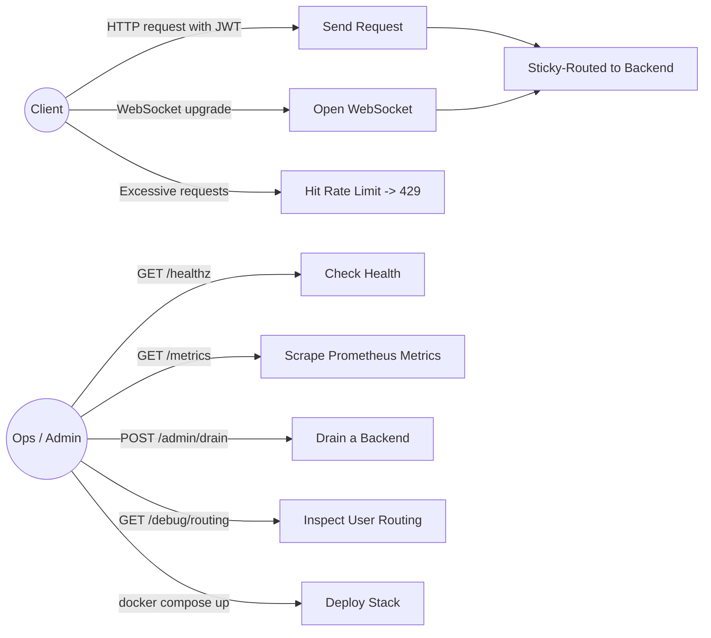
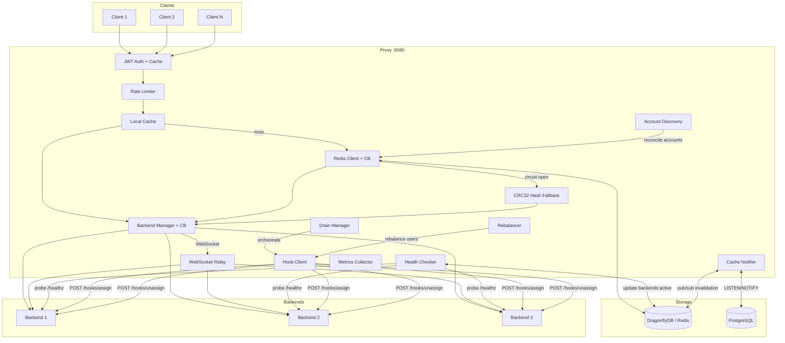
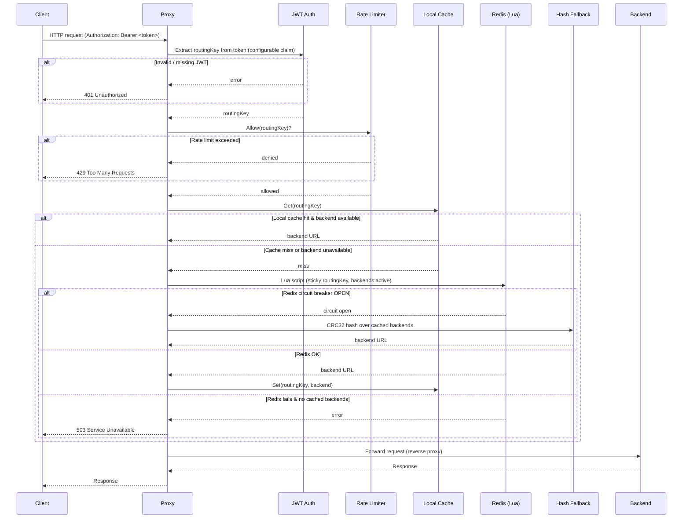
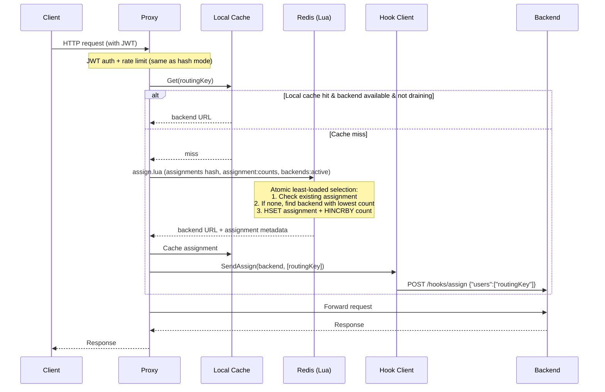
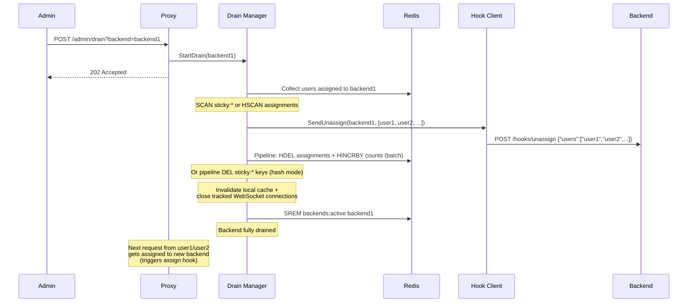
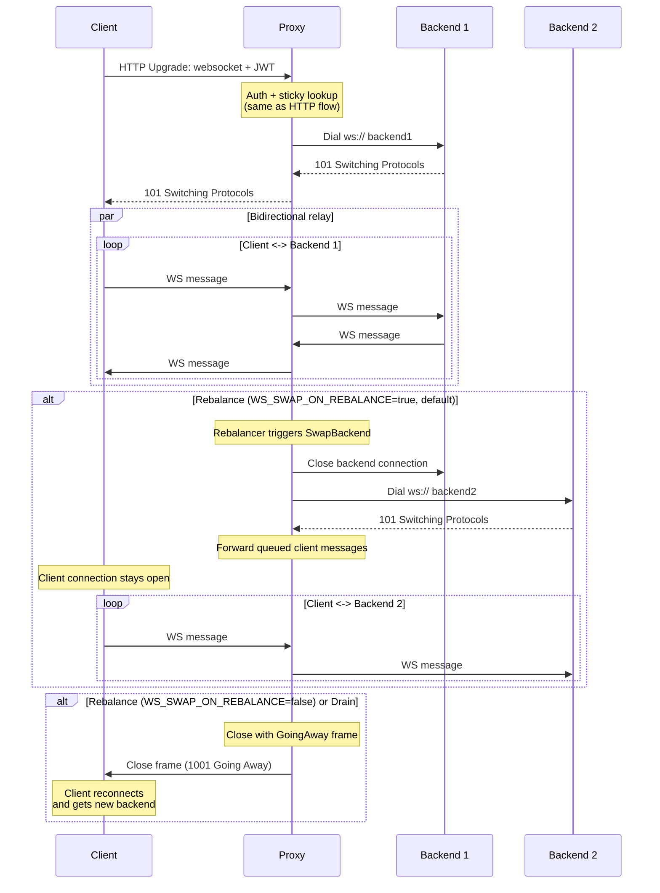
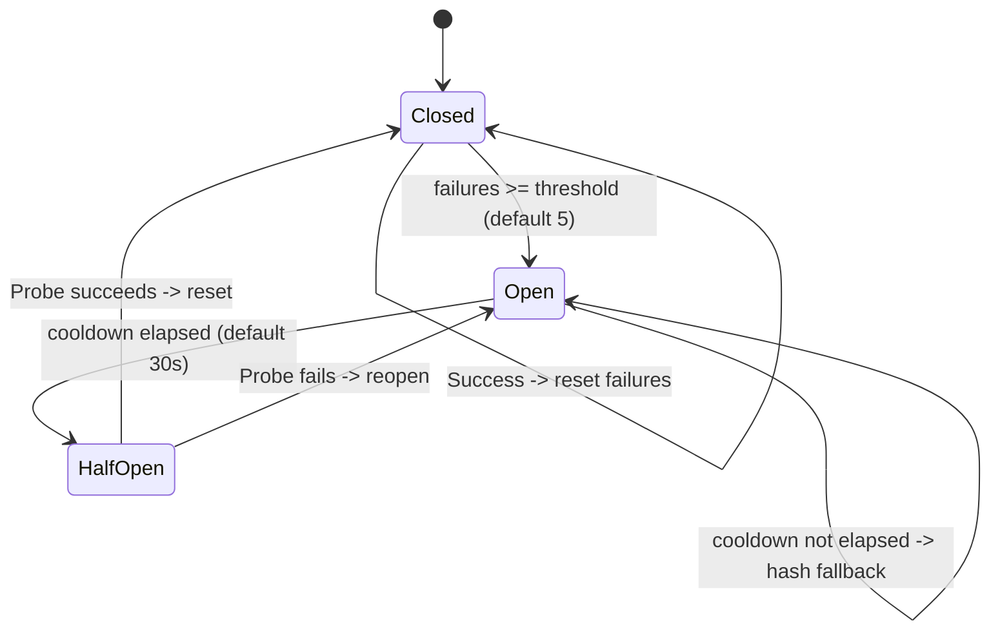
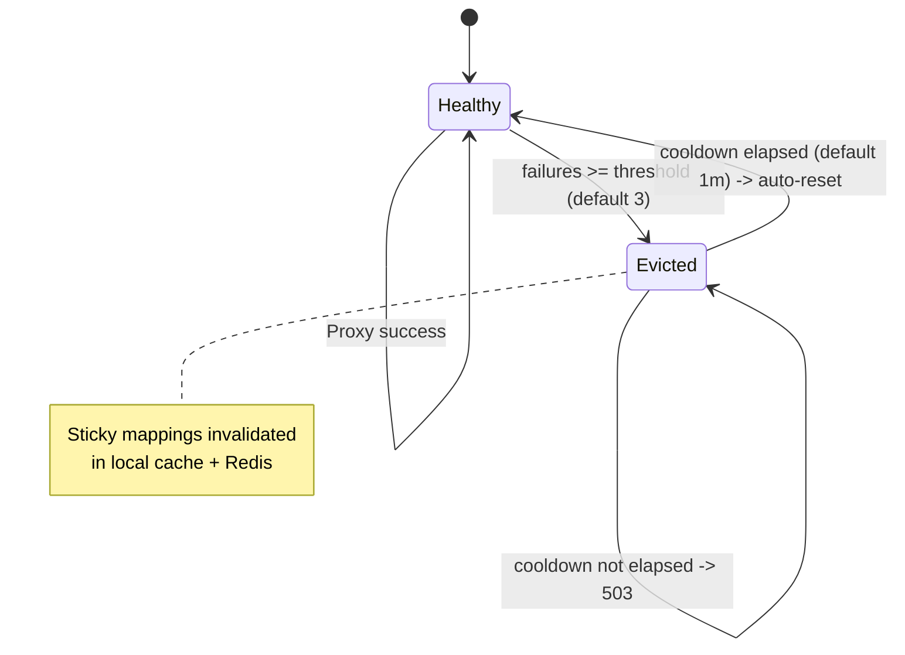
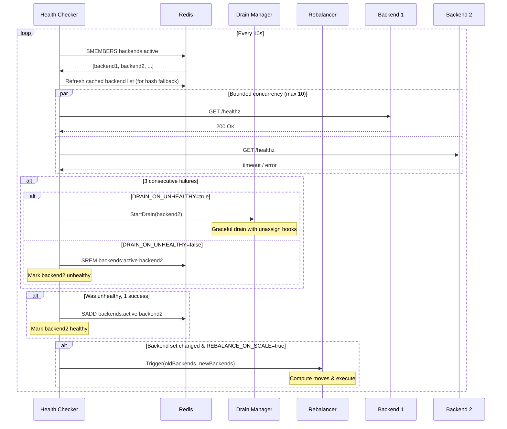
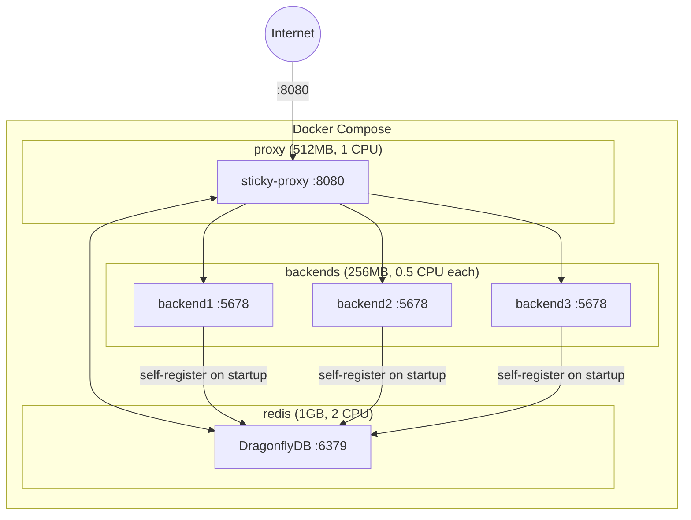

# sticky-proxy

A high-performance stateful-backend orchestrator written in Go. Routes requests from the same user to the same backend server using JWT-based identification and a two-tier caching strategy (local + Redis), with full backend lifecycle management including assign/unassign hooks, graceful drain, account discovery, and rebalancing.

## Features

- **Pluggable assignment store** — choose between Redis, PostgreSQL, or in-memory backend for assignment state; eliminates mandatory Redis dependency when PostgreSQL is already in the stack
- **Sticky sessions** — users are consistently routed to the same backend via store-backed mappings with local cache for fast repeated access
- **Configurable JWT routing** — extracts a configurable claim (default `sub`) from Bearer tokens with HMAC signature validation and token caching
- **Two routing modes** — hash-based routing (default) or assignment-table routing with least-loaded backend selection
- **Assign/unassign hooks** — batch-notifies backends when users are assigned or removed (`{"users": [...]}` payload), enabling stateful preloading and teardown
- **Graceful drain** — drains backends with batch unassign hooks and bulk Redis pipeline deletes; tears down active WebSocket connections so clients reconnect to their new backend
- **Account discovery** — bulk pre-assigns accounts to backends (round-robin) from Redis sets, HTTP endpoints, or PostgreSQL queries via Redis pipeline (HSETNX)
- **Weighted assignments** — discovery queries can return per-account weights; least-loaded strategy and rebalancer consider total weight instead of count, preventing heavy accounts from clustering on one pod
- **Rebalancing** — batch-redistributes users across backends on scale events using least-loaded or consistent-hash strategies, with pipelined Redis operations; preserves account weights through reassignment
- **Request holding during transitions** — optionally holds in-flight requests during drain/rebalance instead of returning errors, making reassignment invisible to clients
- **Poison pill detection** — tracks reassignment frequency per account; quarantines accounts that repeatedly crash backends, preventing cascade failures across the cluster
- **Backend auto-discovery** — DNS polling for headless services / Docker Compose, or event-driven Kubernetes EndpointSlice watch with proactive drain on pod termination
- **WebSocket support** — full bidirectional proxying with sticky session persistence; connections are tracked per user and transparently swapped to new backends during rebalance (client connection stays open), or torn down on drain so clients reconnect
- **Cross-replica cache invalidation** — Redis Pub/Sub or PostgreSQL LISTEN/NOTIFY broadcasts backend invalidation events to all proxy replicas with debounced delivery, preventing stale local cache entries after drains, rebalances, or evictions
- **Circuit breakers** — for both Redis and individual backends, with automatic CRC32 hash fallback when Redis is unavailable
- **Active health checking** — periodic backend probes with configurable intervals; optional auto-drain on unhealthy
- **Per-user rate limiting** — token bucket algorithm (100 tokens/sec, 200 burst) with automatic cleanup
- **Prometheus metrics** — request counters, latency histograms, cache hit rates, hook/drain/rebalance counters on `/metrics`
- **Admin & debug endpoints** — drain management, per-user routing state inspection, and quarantine management
- **Graceful shutdown** — drains in-flight requests on SIGTERM/SIGINT (30s timeout)

## Use Cases



## Architecture

### Component Overview



### HTTP Request Flow (Hash Mode)



### HTTP Request Flow (Assignment Mode)



### Drain Flow



### WebSocket Flow



### Redis Circuit Breaker States



### Backend Circuit Breaker States



### Health Checker Behavior



### Deployment Topology



## Quick Start

### Docker Compose

The included `docker-compose.yml` starts DragonflyDB (Redis-compatible), 3 test backends, and the proxy:

```bash
docker compose up -d
```

The proxy is available at `http://localhost:8080`.

### Build from Source

**Requirements:** Go 1.25+

```bash
make build          # outputs bin/proxy and bin/backend
```

Run with a Redis instance available:

```bash
export JWT_SECRET="your-secret-key"
export REDIS_ADDR="localhost:6379"
./bin/proxy
```

## Configuration

All settings are configured via environment variables. Only `JWT_SECRET` is required.

### Core Settings

| Variable | Default | Description |
|---|---|---|
| `JWT_SECRET` | *required* | HMAC secret for JWT validation |
| `PROXY_PORT` | `:8080` | Proxy listen address |
| `REDIS_ADDR` | `localhost:6379` | Redis/DragonflyDB address |
| `CACHE_TTL` | `24h` | User-to-backend mapping TTL |
| `REDIS_POOL_SIZE` | `100` | Redis connection pool size |
| `REDIS_MIN_IDLE_CONNS` | `10` | Minimum idle Redis connections |
| `REDIS_CB_THRESHOLD` | `5` | Failures before Redis circuit breaker opens |
| `REDIS_CB_COOLDOWN` | `30s` | Redis circuit breaker cooldown period |
| `JWT_CACHE_MAX_SIZE` | `100000` | Maximum cached JWT tokens |
| `EVICTION_THRESHOLD` | `3` | Backend failures before eviction |
| `EVICTION_COOLDOWN` | `1m` | Backend circuit breaker cooldown |
| `BACKEND_HEALTH_INTERVAL` | `10s` | Health check probe frequency |
| `LOG_FORMAT` | `json` | Log format: `json` or `text` |

### Routing

| Variable | Default | Description |
|---|---|---|
| `ROUTING_CLAIM` | `sub` | JWT claim used as the routing key |
| `ROUTING_MODE` | `hash` | Routing strategy: `hash` (CRC32-based) or `assignment` (least-loaded selection via assignment table) |
| `ASSIGNMENT_STORE` | *(auto)* | Assignment backend: `memory`, `redis`, or `postgres`. Defaults to `memory` for hash mode, `postgres` when `ACCOUNTS_DISCOVERY=postgres`, `redis` otherwise |
| `POSTGRES_DSN` | *(empty)* | PostgreSQL connection string (required when `ASSIGNMENT_STORE=postgres` or `ACCOUNTS_DISCOVERY=postgres`) |

> **Breaking change:** `ROUTING_CLAIM` defaults to `"sub"` (standard JWT claim). If your tokens use a different claim (e.g., `"userId"`), set `ROUTING_CLAIM=userId`.

**Assignment store modes:**
- `memory` — in-memory backend list only, no external dependencies. Only valid with `ROUTING_MODE=hash`.
- `redis` — assignments, backend list, and cache invalidation via Redis. Full feature set.
- `postgres` — assignments and backend list in PostgreSQL, cache invalidation via LISTEN/NOTIFY. Eliminates Redis as a dependency when PostgreSQL is already in the stack.

### Hooks

| Variable | Default | Description |
|---|---|---|
| `HOOKS_ENABLED` | `false` | Enable assign/unassign webhook notifications to backends |
| `HOOKS_TIMEOUT` | `5s` | Webhook HTTP request timeout |
| `HOOKS_RETRIES` | `2` | Number of retries on hook delivery failure |

When enabled, the proxy sends:
- `POST {backend}/hooks/assign` with `{"users":["<routingKey>", ...]}` when users are assigned
- `POST {backend}/hooks/unassign` with `{"users":["<routingKey>", ...]}` when users are removed

Single-user operations (e.g., first-request assignment) send a single-element array. Batch operations (drain, rebalance, discovery) send all affected users in one request per backend.

### Drain

| Variable | Default | Description |
|---|---|---|
| `DRAIN_TIMEOUT` | `60s` | Maximum duration for a drain operation |
| `DRAIN_ON_UNHEALTHY` | `false` | Automatically drain backends that fail health checks (requires `HOOKS_ENABLED=true`) |

### Account Discovery

| Variable | Default | Description |
|---|---|---|
| `ACCOUNTS_DISCOVERY` | *(empty)* | Discovery source: `redis`, `http`, or `postgres` (requires `ROUTING_MODE=assignment`) |
| `ACCOUNTS_QUERY` | *(empty)* | Redis set key, HTTP URL, or SQL query for account discovery |
| `ACCOUNTS_REFRESH_INTERVAL` | `30s` | How often to reconcile discovered accounts |

When using `postgres` discovery, `ACCOUNTS_QUERY` should be a SQL query returning account IDs. Optionally include a second column for weight:
```sql
-- Simple: all accounts with default weight (1)
SELECT account_id FROM accounts WHERE active = true

-- Weighted: heavy accounts get proportionally more backend capacity
SELECT account_id, resource_weight FROM accounts WHERE active = true
```

When using `http` discovery, the endpoint can return either format:
```json
["acct-1", "acct-2"]
[{"id": "acct-1", "weight": 10}, {"id": "acct-2", "weight": 1}]
```

Weights flow through to the assignment table and are used by the `least-loaded` rebalance strategy. Accounts with weight 0 or absent default to 1.

### Backend Discovery

| Variable | Default | Description |
|---|---|---|
| `BACKEND_DISCOVERY` | *(empty)* | Discovery method: `dns` or `kubernetes` |
| `BACKEND_DISCOVERY_HOST` | *(empty)* | DNS hostname to resolve for backend IPs (required when `dns`) |
| `BACKEND_DISCOVERY_PORT` | `5678` | Port to use when building backend URLs from resolved IPs (`dns` only) |
| `BACKEND_DISCOVERY_INTERVAL` | `10s` | How often to resolve DNS and reconcile backends (`dns` only) |
| `BACKEND_DISCOVERY_NAMESPACE` | *(auto-detect)* | Kubernetes namespace. Auto-detects via downward API, falls back to `default` (`kubernetes` only) |
| `BACKEND_DISCOVERY_SELECTOR` | *(empty)* | Label selector for EndpointSlices, e.g. `kubernetes.io/service-name=my-backend` (required when `kubernetes`) |
| `BACKEND_DISCOVERY_PORT_NAME` | *(empty)* | Named port to match in EndpointSlice. Empty = first port (`kubernetes` only) |

#### DNS mode (`BACKEND_DISCOVERY=dns`)

Periodically resolves `BACKEND_DISCOVERY_HOST` via DNS, builds `http://{ip}:{port}` URLs for each resolved address, and syncs them against `backends:active` in Redis. Works with:
- **Kubernetes headless services** — DNS returns all pod IPs
- **Docker Compose** — DNS returns container IPs for service names

#### Kubernetes mode (`BACKEND_DISCOVERY=kubernetes`)

Watches [EndpointSlice](https://kubernetes.io/docs/concepts/services-networking/endpoint-slices/) resources via `k8s.io/client-go` informers. Event-driven — no polling. Uses in-cluster config automatically, falling back to `KUBECONFIG` / `~/.kube/config` for local development.

The key advantage over DNS is **proactive drain on pod termination**. EndpointSlice exposes three conditions per endpoint:

| Condition | Meaning |
|---|---|
| `ready` | Pod is passing readiness probes |
| `serving` | Pod can still serve traffic (even while terminating) |
| `terminating` | Pod received SIGTERM, shutdown in progress |

The proxy maps these to backend actions:

| State | Conditions | Action |
|---|---|---|
| Starting | `ready=false, serving=false, terminating=false` | Ignore (not ready yet) |
| Ready | `ready=true, serving=true, terminating=false` | Add to `backends:active` |
| Terminating | `ready=false, serving=true, terminating=true` | **Start drain immediately** |
| Gone | Removed from EndpointSlice | Remove from `backends:active` |

When a pod enters the **Terminating** state, the proxy starts draining it immediately — while the pod is still `serving=true`, so unassign hooks land reliably. This turns drain from a "react to health-check failure" pattern into a "coordinate with the orchestrator" pattern.

**RBAC requirements:** The proxy's ServiceAccount needs `get`, `list`, and `watch` on `endpointslices` in the `discovery.k8s.io` API group within the configured namespace.

Backends discovered via either method are still validated by the health checker before receiving traffic.

### Request Holding

| Variable | Default | Description |
|---|---|---|
| `HOLD_DURING_TRANSITION` | `false` | Hold in-flight requests during drain/rebalance instead of returning errors |
| `HOLD_TIMEOUT` | `5s` | Maximum time to hold a request before giving up |

When enabled, requests for users mid-transition (drain or rebalance in progress) are held until the new assignment is ready, making reassignment invisible to clients.

### Poison Pill Detection

| Variable | Default | Description |
|---|---|---|
| `POISON_PILL_ACTION` | *(empty)* | Set to `quarantine` to enable poison pill detection |
| `POISON_PILL_THRESHOLD` | `3` | Number of reassignments within window to trigger quarantine |
| `POISON_PILL_WINDOW` | `5m` | Sliding window for reassignment tracking |

When an account repeatedly crashes backends (causing forced reassignments), it is quarantined — the proxy returns 503 instead of assigning it to another backend, preventing cascade failures.

### Rebalancing

| Variable | Default | Description |
|---|---|---|
| `REBALANCE_STRATEGY` | `none` | Strategy: `none`, `least-loaded`, or `consistent-hash` (requires `ROUTING_MODE=assignment`) |
| `REBALANCE_ON_SCALE` | `false` | Trigger rebalance when the backend set changes |
| `WS_SWAP_ON_REBALANCE` | `true` | Transparent WebSocket backend swap during rebalance. When `true` (default), the client connection stays open and only the backend connection is replaced. Set to `false` to close connections and let clients reconnect. |

The `least-loaded` strategy considers total weight per backend (not just count) when accounts have weights assigned via discovery.

## Endpoints

### Proxy

| Path | Method | Description |
|---|---|---|
| `/*` | ANY | Proxy handler — routes to sticky backend |
| `/healthz` | GET | Health check — returns Redis and backend status |
| `/metrics` | GET | Prometheus metrics in text exposition format |

### Admin

| Path | Method | Description |
|---|---|---|
| `/admin/drain` | POST | Start draining a backend. Query param: `backend=<url>`. Returns 202. |
| `/admin/drain` | GET | List all currently draining backends |
| `/admin/drain` | DELETE | Cancel a drain. Query param: `backend=<url>` |

### Debug

| Path | Method | Description |
|---|---|---|
| `/debug/routing` | GET | Query routing state for a user. Query param: `user=<routingKey>`. Returns JSON with backend, source, cache layer. |

### Backend Hooks (received by backends)

| Path | Method | Description |
|---|---|---|
| `/hooks/assign` | POST | Notification that users have been assigned. Body: `{"users":["<routingKey>", ...]}` |
| `/hooks/unassign` | POST | Notification that users have been removed. Body: `{"users":["<routingKey>", ...]}` |

## Redis Data Model

| Key / Channel | Type | Description |
|---|---|---|
| `sticky:{routingKey}` | STRING | Maps a user to their assigned backend URL (hash mode) |
| `backends:active` | SET | All currently healthy backend URLs |
| `assignments` | HASH | routingKey -> JSON `{backend, assigned_at, source, weight}` (assignment mode) |
| `assignment:counts` | HASH | backend URL -> total weight of assigned users (assignment mode) |
| `sticky-proxy:cache-invalidate` | PUB/SUB | Cross-replica cache invalidation; payload is the backend URL to invalidate |

## PostgreSQL Data Model

When `ASSIGNMENT_STORE=postgres`, the proxy auto-creates these tables on startup:

| Table | Key Columns | Description |
|---|---|---|
| `backends` | `url` (PK), `healthy`, `discovered_at` | Backend registry. `RemoveBackend` sets `healthy=false` (soft delete). |
| `assignments` | `routing_key` (PK), `backend`, `assigned_at`, `source`, `weight` | User-to-backend assignments with optional weight. Index on `backend` for efficient lookups. |

Cache invalidation uses the `cache_invalidate` NOTIFY channel (payload: backend URL).

## Prometheus Metrics

| Metric | Type | Description |
|---|---|---|
| `stickyproxy_requests_total` | counter | Total requests received |
| `stickyproxy_backend_requests_total` | counter | Requests per backend (labeled) |
| `stickyproxy_backend_errors_total` | counter | Backend proxy errors |
| `stickyproxy_redis_failures_total` | counter | Redis operation failures |
| `stickyproxy_redis_cb_fallbacks_total` | counter | Hash fallbacks due to circuit breaker |
| `stickyproxy_cache_hits_total` | counter | Cache hits by layer (`local`, `redis`) |
| `stickyproxy_cache_misses_total` | counter | Cache misses (new assignments) |
| `stickyproxy_auth_failures_total` | counter | JWT authentication failures |
| `stickyproxy_websocket_connections_total` | counter | WebSocket connections opened |
| `stickyproxy_rate_limited_total` | counter | Requests rejected by rate limiter |
| `stickyproxy_hook_assigns_total` | counter | Assign hooks sent to backends |
| `stickyproxy_hook_unassigns_total` | counter | Unassign hooks sent to backends |
| `stickyproxy_hook_failures_total` | counter | Hook delivery failures |
| `stickyproxy_drains_total` | counter | Drain operations started |
| `stickyproxy_drain_users_total` | counter | Users unassigned during drains |
| `stickyproxy_rebalances_total` | counter | Rebalance operations triggered |
| `stickyproxy_rebalance_moves_total` | counter | User moves during rebalances |
| `stickyproxy_active_connections` | gauge | Currently active connections |
| `stickyproxy_healthy_backends` | gauge | Number of healthy backends |
| `stickyproxy_draining_backends` | gauge | Number of backends currently draining |
| `stickyproxy_hold_requests_total` | counter | Requests held during assignment transitions |
| `stickyproxy_hold_timeouts_total` | counter | Held requests that exceeded the hold timeout |
| `stickyproxy_poison_pill_detections_total` | counter | Accounts quarantined by poison pill detection |
| `stickyproxy_poison_pill_blocked_total` | counter | Requests blocked due to account quarantine |
| `stickyproxy_quarantined_accounts` | gauge | Number of accounts currently quarantined |
| `stickyproxy_request_duration_seconds` | histogram | Request latency distribution |

## Development

```bash
make test           # run tests with race detector
make lint           # run golangci-lint
make vet            # run go vet
make fmt            # format code
make fmt-check      # verify formatting
```

### Project Structure

```
cmd/
  proxy/              # main proxy server
  backend/            # test backend (self-registers in Redis, handles hooks)
internal/
  config/             # environment-based configuration
  proxy/              # core proxy logic
    proxy.go          # HTTP handler and routing orchestrator
    backends.go       # backend manager with circuit breaker
    redis.go          # Redis client with circuit breaker
    store.go          # Store and BackendList interfaces
    store_redis.go    # Redis Store adapter
    store_postgres.go # PostgreSQL Store implementation
    store_memory.go   # in-memory backend list (hash mode)
    user_cache.go     # local in-memory sticky cache
    cache_notifier.go          # CacheNotifier interface + Redis Pub/Sub impl
    cache_notifier_postgres.go # PostgreSQL LISTEN/NOTIFY impl
    jwt.go            # JWT token extraction (configurable claim)
    jwt_cache.go      # JWT token caching
    health_checker.go # active backend health probes
    rate_limiter.go   # per-user token bucket
    websocket.go      # WebSocket bidirectional relay
    metrics.go        # Prometheus metrics
    hashing.go        # CRC32-based user hashing
    hooks.go          # assign/unassign webhook client (batch payloads)
    drain.go          # graceful backend drain manager (batch operations)
    conn_tracker.go   # WebSocket connection tracker for drain/rebalance teardown
    admin.go          # admin HTTP handlers (/admin/drain)
    debug.go          # debug HTTP handler (/debug/routing)
    assignment.go     # assignment table data types
    assign.lua        # Redis Lua script for assignment-table routing
    sticky.lua        # Redis Lua script for hash-based routing
    discovery.go      # account discovery orchestrator
    discovery_redis.go    # Redis set account source
    discovery_http.go     # HTTP JSON account source
    discovery_postgres.go  # PostgreSQL query account source
    discovery_backends.go     # DNS-based backend pod discovery
    discovery_kubernetes.go   # Kubernetes EndpointSlice backend discovery
    rebalancer.go          # rebalancing strategies and batch executor (weight-aware)
    hold.go                # request holding during assignment transitions
    poison.go              # poison pill detection and account quarantine
pkg/
  ownership/          # backend ownership checker (Redis MGET on sticky:* keys)
k6/                   # load testing utilities
```

### CI

GitHub Actions runs on push to `main` and on pull requests:
- Build, vet, format check, and tests (with `-race`)
- Linting via golangci-lint v2.4

## License

Apache License 2.0 — see [LICENSE](LICENSE).
