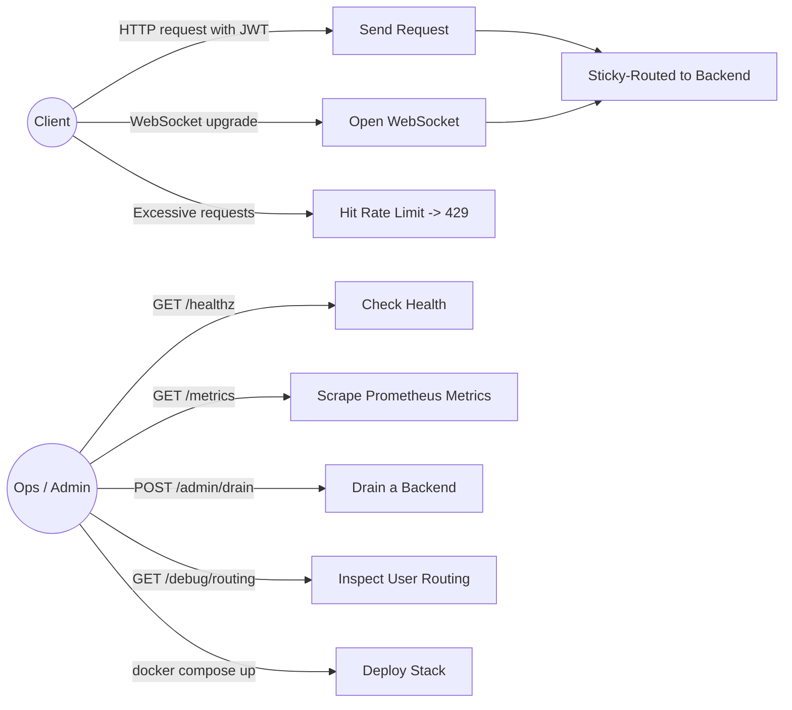
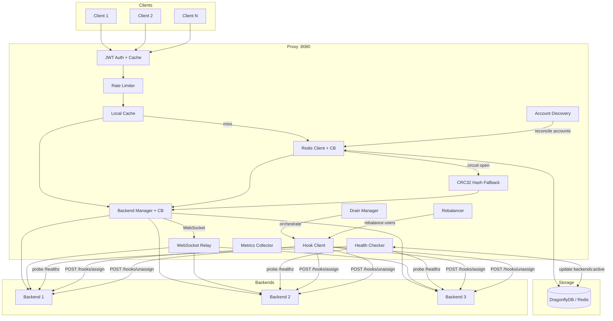
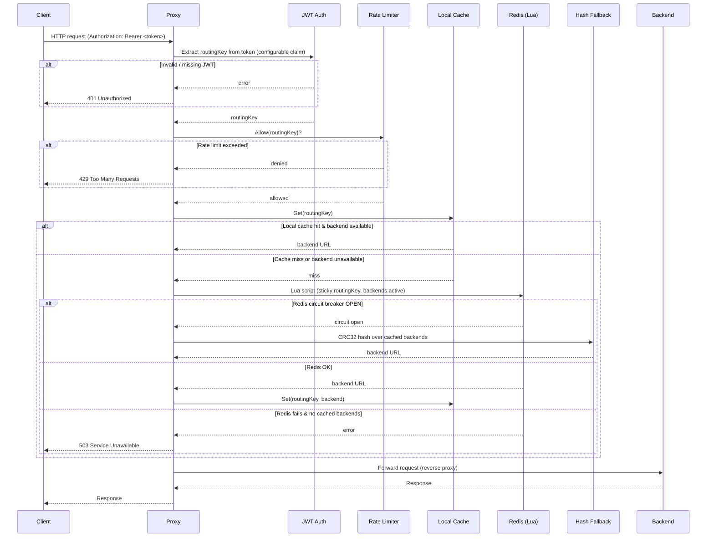
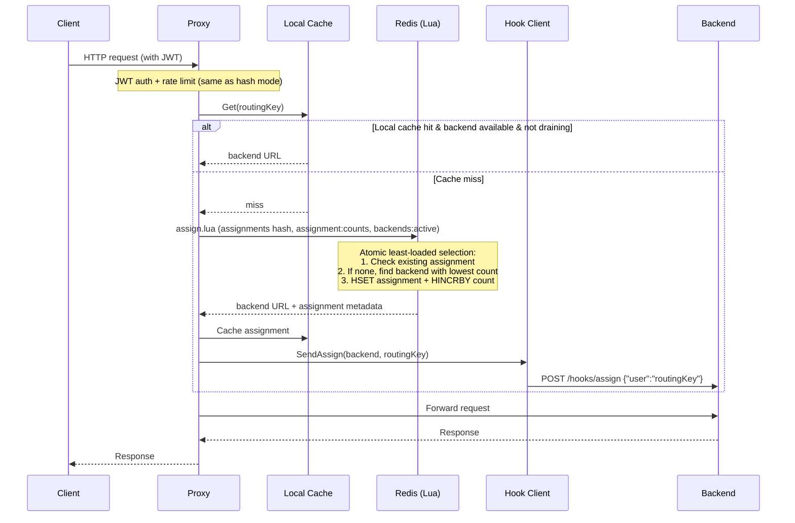
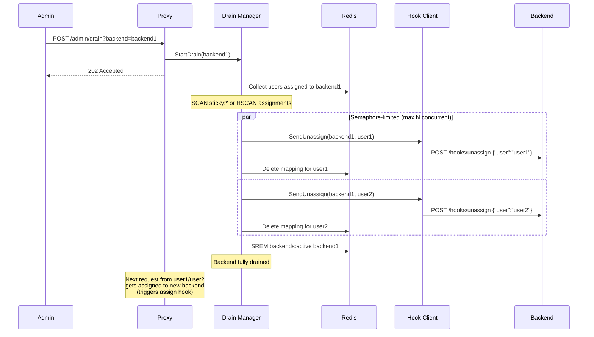
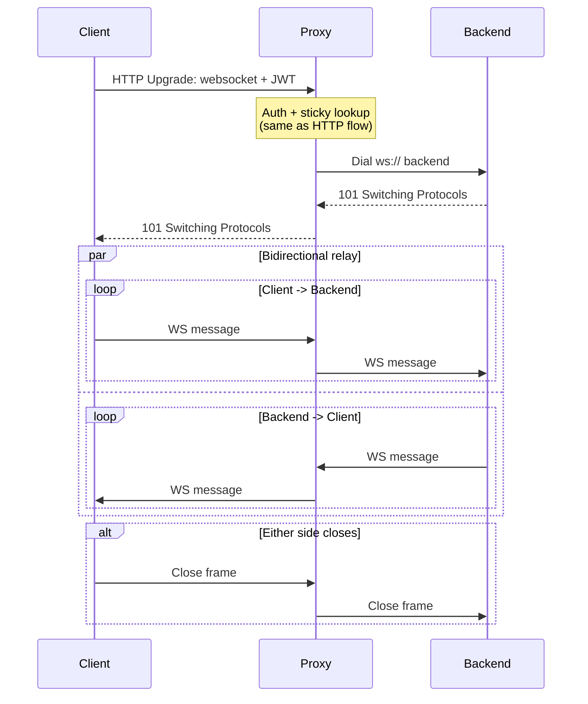
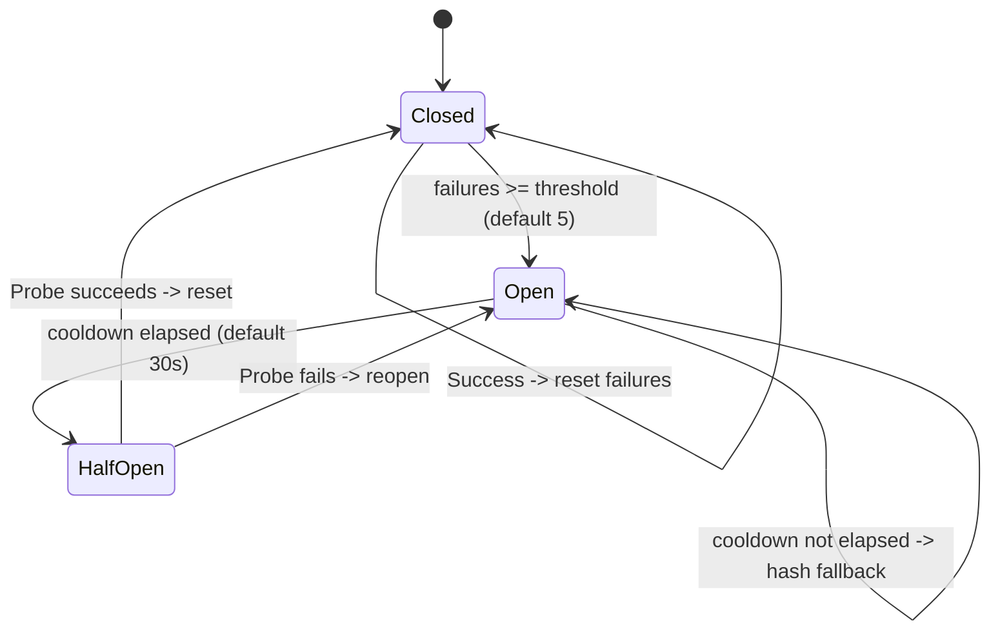
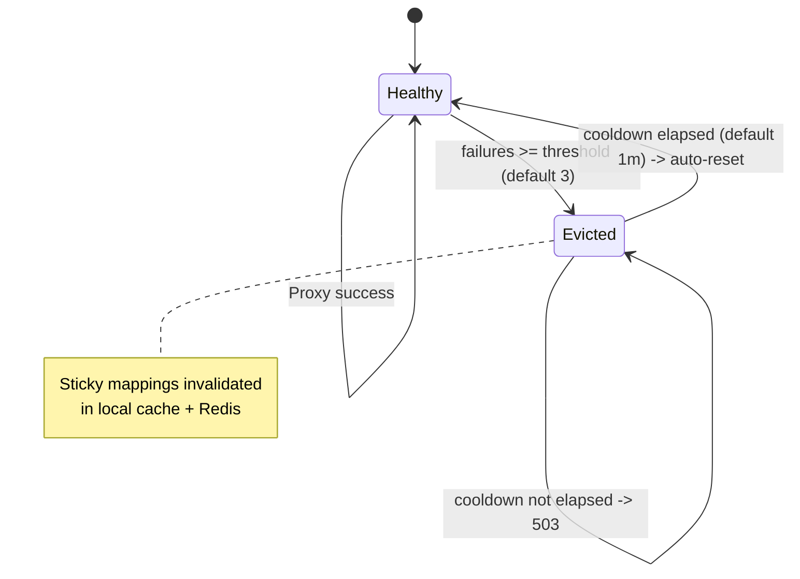
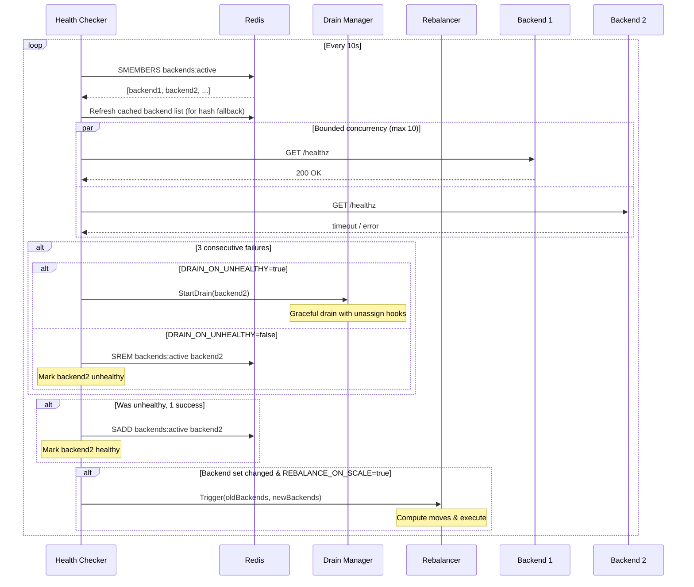
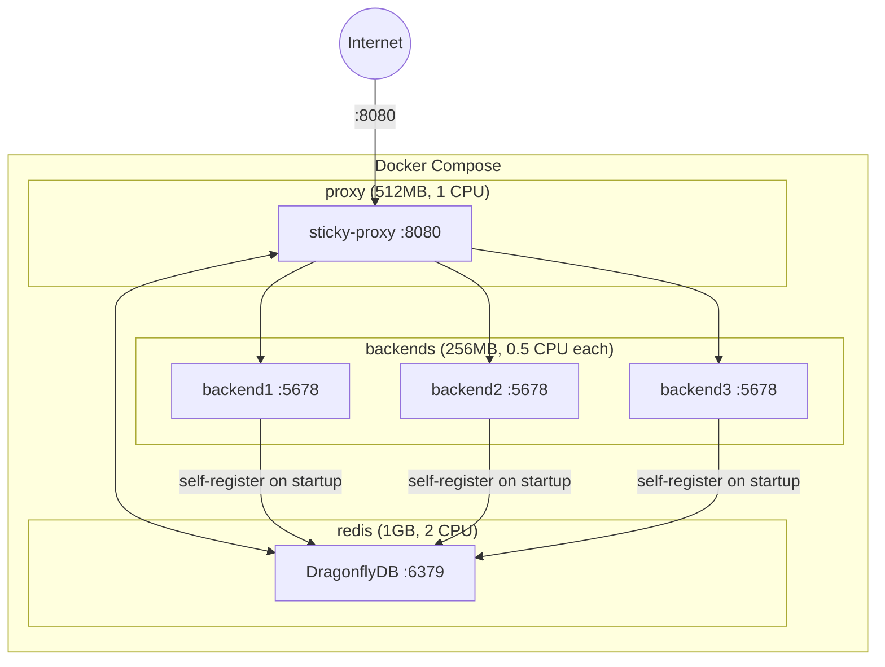

# sticky-proxy

A high-performance stateful-backend orchestrator written in Go. Routes requests from the same user to the same backend server using JWT-based identification and a two-tier caching strategy (local + Redis), with full backend lifecycle management including assign/unassign hooks, graceful drain, account discovery, and rebalancing.

## Features

- **Sticky sessions** — users are consistently routed to the same backend via Redis-backed mappings with local cache for fast repeated access
- **Configurable JWT routing** — extracts a configurable claim (default `sub`) from Bearer tokens with HMAC signature validation and token caching
- **Two routing modes** — hash-based routing (default) or assignment-table routing with least-loaded backend selection
- **Assign/unassign hooks** — notifies backends when users are assigned or removed, enabling stateful preloading and teardown
- **Graceful drain** — drains backends by unassigning all users with concurrent hook notifications before removal
- **Account discovery** — pre-assigns accounts to backends from Redis sets, HTTP endpoints, or PostgreSQL queries, even when no client is connected
- **Rebalancing** — redistributes users across backends on scale events using least-loaded or consistent-hash strategies
- **WebSocket support** — full bidirectional proxying with sticky session persistence
- **Circuit breakers** — for both Redis and individual backends, with automatic CRC32 hash fallback when Redis is unavailable
- **Active health checking** — periodic backend probes with configurable intervals; optional auto-drain on unhealthy
- **Per-user rate limiting** — token bucket algorithm (100 tokens/sec, 200 burst) with automatic cleanup
- **Prometheus metrics** — request counters, latency histograms, cache hit rates, hook/drain/rebalance counters on `/metrics`
- **Admin & debug endpoints** — drain management and per-user routing state inspection
- **Graceful shutdown** — drains in-flight requests on SIGTERM/SIGINT (30s timeout)

## Use Cases



## Architecture

### Component Overview



### HTTP Request Flow (Hash Mode)



### HTTP Request Flow (Assignment Mode)



### Drain Flow



### WebSocket Flow



### Redis Circuit Breaker States



### Backend Circuit Breaker States



### Health Checker Behavior



### Deployment Topology



## Quick Start

### Docker Compose

The included `docker-compose.yml` starts DragonflyDB (Redis-compatible), 3 test backends, and the proxy:

```bash
docker compose up -d
```

The proxy is available at `http://localhost:8080`.

### Build from Source

**Requirements:** Go 1.25+

```bash
make build          # outputs bin/proxy and bin/backend
```

Run with a Redis instance available:

```bash
export JWT_SECRET="your-secret-key"
export REDIS_ADDR="localhost:6379"
./bin/proxy
```

## Configuration

All settings are configured via environment variables. Only `JWT_SECRET` is required.

### Core Settings

| Variable | Default | Description |
|---|---|---|
| `JWT_SECRET` | *required* | HMAC secret for JWT validation |
| `PROXY_PORT` | `:8080` | Proxy listen address |
| `REDIS_ADDR` | `localhost:6379` | Redis/DragonflyDB address |
| `CACHE_TTL` | `24h` | User-to-backend mapping TTL |
| `REDIS_POOL_SIZE` | `100` | Redis connection pool size |
| `REDIS_MIN_IDLE_CONNS` | `10` | Minimum idle Redis connections |
| `REDIS_CB_THRESHOLD` | `5` | Failures before Redis circuit breaker opens |
| `REDIS_CB_COOLDOWN` | `30s` | Redis circuit breaker cooldown period |
| `JWT_CACHE_MAX_SIZE` | `100000` | Maximum cached JWT tokens |
| `EVICTION_THRESHOLD` | `3` | Backend failures before eviction |
| `EVICTION_COOLDOWN` | `1m` | Backend circuit breaker cooldown |
| `BACKEND_HEALTH_INTERVAL` | `10s` | Health check probe frequency |
| `LOG_FORMAT` | `json` | Log format: `json` or `text` |

### Routing

| Variable | Default | Description |
|---|---|---|
| `ROUTING_CLAIM` | `sub` | JWT claim used as the routing key |
| `ROUTING_MODE` | `hash` | Routing strategy: `hash` (CRC32-based) or `assignment` (Redis assignment table with least-loaded selection) |

> **Breaking change:** `ROUTING_CLAIM` defaults to `"sub"` (standard JWT claim). If your tokens use a different claim (e.g., `"userId"`), set `ROUTING_CLAIM=userId`.

### Hooks

| Variable | Default | Description |
|---|---|---|
| `HOOKS_ENABLED` | `false` | Enable assign/unassign webhook notifications to backends |
| `HOOKS_TIMEOUT` | `5s` | Webhook HTTP request timeout |
| `HOOKS_RETRIES` | `2` | Number of retries on hook delivery failure |

When enabled, the proxy sends:
- `POST {backend}/hooks/assign` with `{"user":"<routingKey>"}` when a user is assigned
- `POST {backend}/hooks/unassign` with `{"user":"<routingKey>"}` when a user is removed

### Drain

| Variable | Default | Description |
|---|---|---|
| `DRAIN_TIMEOUT` | `60s` | Maximum duration for a drain operation |
| `DRAIN_MAX_CONCURRENT` | `10` | Maximum concurrent unassign operations during drain |
| `DRAIN_ON_UNHEALTHY` | `false` | Automatically drain backends that fail health checks (requires `HOOKS_ENABLED=true`) |

### Account Discovery

| Variable | Default | Description |
|---|---|---|
| `ACCOUNTS_DISCOVERY` | *(empty)* | Discovery source: `redis`, `http`, or `postgres` (requires `ROUTING_MODE=assignment`) |
| `ACCOUNTS_QUERY` | *(empty)* | Redis set key, HTTP URL, or SQL query for account discovery |
| `ACCOUNTS_REFRESH_INTERVAL` | `30s` | How often to reconcile discovered accounts |
| `POSTGRES_DSN` | *(empty)* | PostgreSQL connection string (required when `ACCOUNTS_DISCOVERY=postgres`) |

When using `postgres` discovery, `ACCOUNTS_QUERY` should be a SQL query that returns a single text column of account IDs, e.g.:
```sql
SELECT account_id FROM accounts WHERE active = true
```

### Rebalancing

| Variable | Default | Description |
|---|---|---|
| `REBALANCE_STRATEGY` | `none` | Strategy: `none`, `least-loaded`, or `consistent-hash` (requires `ROUTING_MODE=assignment`) |
| `REBALANCE_ON_SCALE` | `false` | Trigger rebalance when the backend set changes |
| `REBALANCE_MAX_CONCURRENT` | `10` | Maximum concurrent moves during rebalance |

## Endpoints

### Proxy

| Path | Method | Description |
|---|---|---|
| `/*` | ANY | Proxy handler — routes to sticky backend |
| `/healthz` | GET | Health check — returns Redis and backend status |
| `/metrics` | GET | Prometheus metrics in text exposition format |

### Admin

| Path | Method | Description |
|---|---|---|
| `/admin/drain` | POST | Start draining a backend. Query param: `backend=<url>`. Returns 202. |
| `/admin/drain` | GET | List all currently draining backends |
| `/admin/drain` | DELETE | Cancel a drain. Query param: `backend=<url>` |

### Debug

| Path | Method | Description |
|---|---|---|
| `/debug/routing` | GET | Query routing state for a user. Query param: `user=<routingKey>`. Returns JSON with backend, source, cache layer. |

### Backend Hooks (received by backends)

| Path | Method | Description |
|---|---|---|
| `/hooks/assign` | POST | Notification that a user has been assigned. Body: `{"user":"<routingKey>"}` |
| `/hooks/unassign` | POST | Notification that a user has been removed. Body: `{"user":"<routingKey>"}` |

## Redis Data Model

| Key | Type | Description |
|---|---|---|
| `sticky:{routingKey}` | STRING | Maps a user to their assigned backend URL (hash mode) |
| `backends:active` | SET | All currently healthy backend URLs |
| `assignments` | HASH | routingKey -> JSON `{backend, assigned_at, source}` (assignment mode) |
| `assignment:counts` | HASH | backend URL -> number of assigned users (assignment mode) |

## Prometheus Metrics

| Metric | Type | Description |
|---|---|---|
| `stickyproxy_requests_total` | counter | Total requests received |
| `stickyproxy_backend_requests_total` | counter | Requests per backend (labeled) |
| `stickyproxy_backend_errors_total` | counter | Backend proxy errors |
| `stickyproxy_redis_failures_total` | counter | Redis operation failures |
| `stickyproxy_redis_cb_fallbacks_total` | counter | Hash fallbacks due to circuit breaker |
| `stickyproxy_cache_hits_total` | counter | Cache hits by layer (`local`, `redis`) |
| `stickyproxy_cache_misses_total` | counter | Cache misses (new assignments) |
| `stickyproxy_auth_failures_total` | counter | JWT authentication failures |
| `stickyproxy_websocket_connections_total` | counter | WebSocket connections opened |
| `stickyproxy_rate_limited_total` | counter | Requests rejected by rate limiter |
| `stickyproxy_hook_assigns_total` | counter | Assign hooks sent to backends |
| `stickyproxy_hook_unassigns_total` | counter | Unassign hooks sent to backends |
| `stickyproxy_hook_failures_total` | counter | Hook delivery failures |
| `stickyproxy_drains_total` | counter | Drain operations started |
| `stickyproxy_drain_users_total` | counter | Users unassigned during drains |
| `stickyproxy_rebalances_total` | counter | Rebalance operations triggered |
| `stickyproxy_rebalance_moves_total` | counter | User moves during rebalances |
| `stickyproxy_active_connections` | gauge | Currently active connections |
| `stickyproxy_healthy_backends` | gauge | Number of healthy backends |
| `stickyproxy_draining_backends` | gauge | Number of backends currently draining |
| `stickyproxy_request_duration_seconds` | histogram | Request latency distribution |

## Development

```bash
make test           # run tests with race detector
make lint           # run golangci-lint
make vet            # run go vet
make fmt            # format code
make fmt-check      # verify formatting
```

### Project Structure

```
cmd/
  proxy/              # main proxy server
  backend/            # test backend (self-registers in Redis, handles hooks)
internal/
  config/             # environment-based configuration
  proxy/              # core proxy logic
    proxy.go          # HTTP handler and routing orchestrator
    backends.go       # backend manager with circuit breaker
    redis.go          # Redis client with circuit breaker
    user_cache.go     # local in-memory sticky cache
    jwt.go            # JWT token extraction (configurable claim)
    jwt_cache.go      # JWT token caching
    health_checker.go # active backend health probes
    rate_limiter.go   # per-user token bucket
    websocket.go      # WebSocket bidirectional relay
    metrics.go        # Prometheus metrics
    hashing.go        # CRC32-based user hashing
    hooks.go          # assign/unassign webhook client
    drain.go          # graceful backend drain manager
    admin.go          # admin HTTP handlers (/admin/drain)
    debug.go          # debug HTTP handler (/debug/routing)
    assignment.go     # assignment table data types
    assign.lua        # Redis Lua script for assignment-table routing
    sticky.lua        # Redis Lua script for hash-based routing
    discovery.go      # account discovery orchestrator
    discovery_redis.go    # Redis set account source
    discovery_http.go     # HTTP JSON account source
    discovery_postgres.go # PostgreSQL query account source
    rebalancer.go     # rebalancing strategies and executor
pkg/
  ownership/          # backend ownership checker (Redis MGET on sticky:* keys)
k6/                   # load testing utilities
```

### CI

GitHub Actions runs on push to `main` and on pull requests:
- Build, vet, format check, and tests (with `-race`)
- Linting via golangci-lint v2.4

## License

Apache License 2.0 — see [LICENSE](LICENSE).
